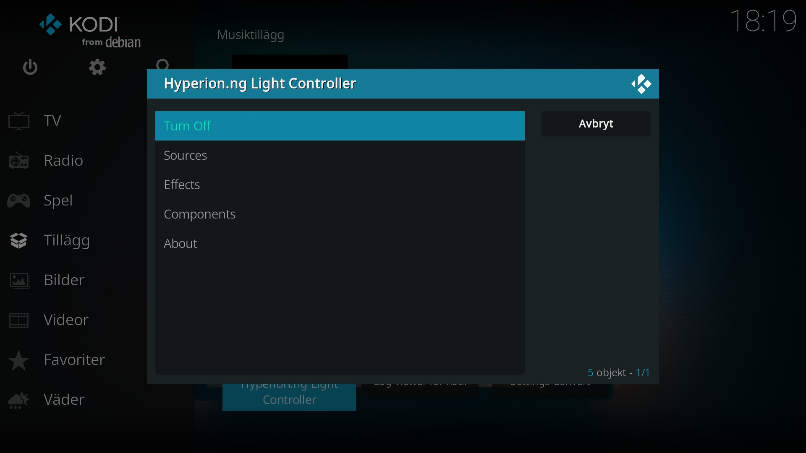
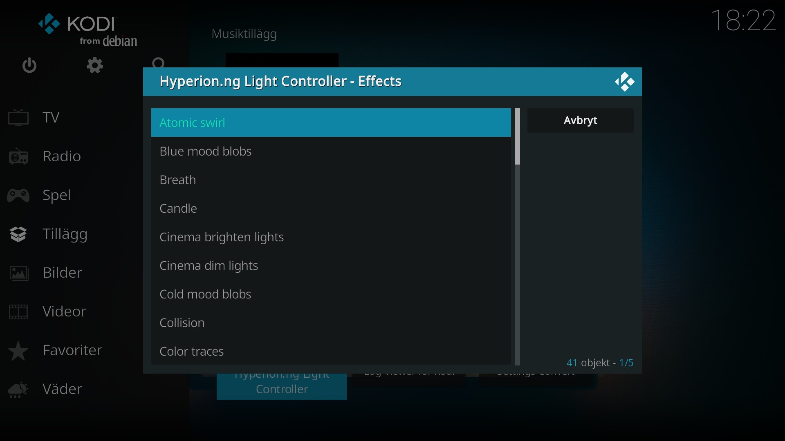
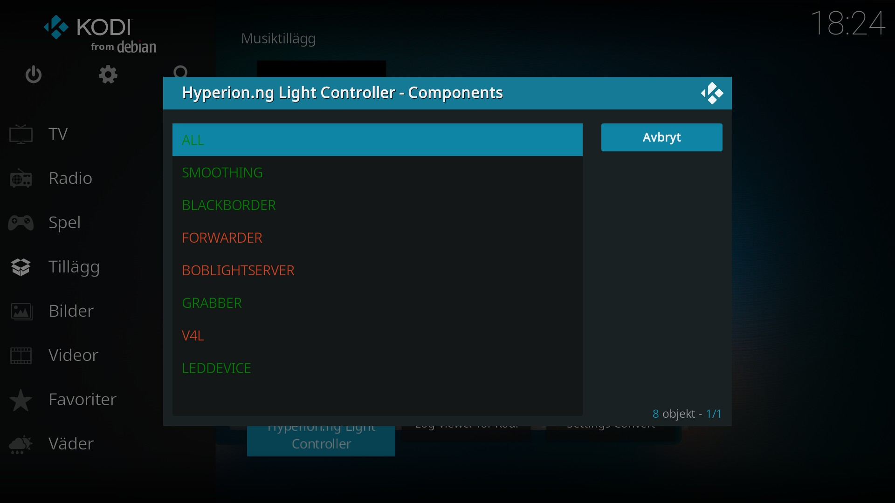

# Hyperion.ng Light Controller
Hyperion-ng Light Controller is a Kodi add-on which provides a simple and intuitive GUI for controlling your Hyperion server. The add-on works by sending JSON-RPC over http/https to the Hyperion server.

* Features
	* Turn on/off LEDs
	* Source selection
	* Set and activate effect pattern
	* Components Control, eg. toggle bias lighting, black-border detection etc.
	* Token authorization
	
## Configuration
To connect to the Hyperion server, enter the IP and port number of the server as well as application protocol (http or https) into the settings menu. By default the add-on assumes the Hyperion server runs on localhost (127.0.0.1) on port 8090 via http. Note, that this add-on is not for configuring or setting up your Hyperion server, for this purpose use the Web-UI or the CLI.

## Screenshots
<table>
  <tr>
    <td></td>
    <td></td>
    <td></td>
    <td></td>
  </tr>
 </table>

## Disclaimer
This add-on is unofficial and its author has no affiliation with https://docs.hyperion-project.org.

## Additional notes
Also check out the official Kodi controller which has more features: https://github.com/hyperion-project/hyperion.control 
